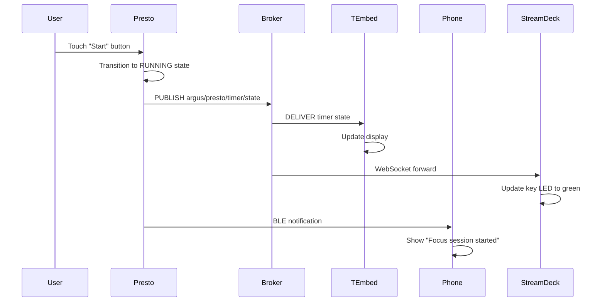
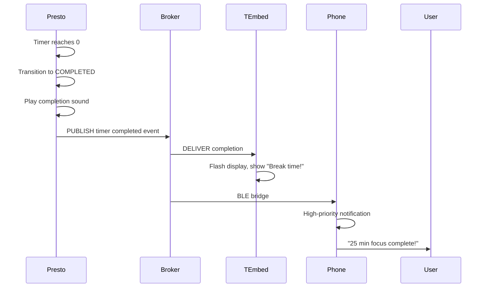
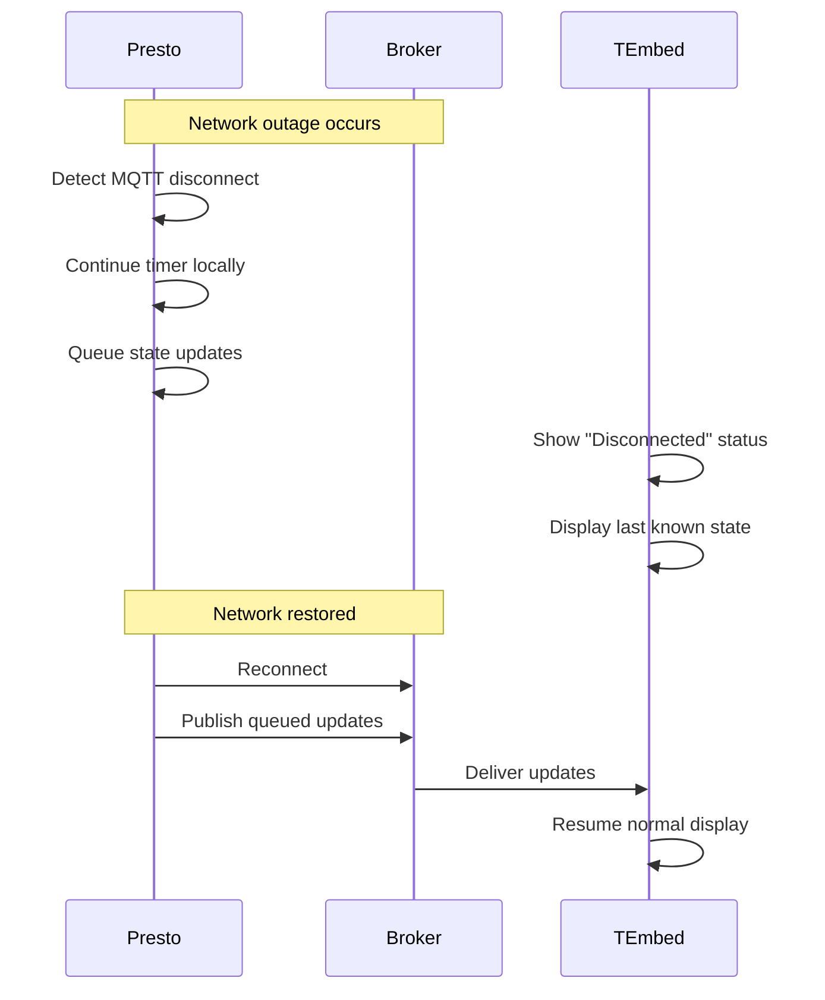

# Argus System Architecture

This document provides detailed architecture and implementation specifications for the Argus distributed IoT timer system.

## System Overview

Argus is a multi-device Pomodoro timer system designed for focus and productivity. It demonstrates distributed IoT architecture principles through coordinated operation of heterogeneous devices.

### Design Goals

1. **Distributed Operation**: Multiple devices coordinate without tight coupling
2. **Offline Resilience**: Devices operate autonomously during network outages
3. **Real-Time Responsiveness**: Sub-100ms latency for user interactions
4. **Extensibility**: Easy to add new devices or features
5. **Observability**: Clear logging and state visibility for debugging

## Component Specifications

### 1. Presto (Central Timer Device)

**Hardware**: Pimoroni Presto (RP2350 + 4" touchscreen)

**Responsibilities**:
- Primary timer logic and state management
- User input via touchscreen
- RGB backlight for visual feedback
- Timer state publishing via MQTT
- Autonomous operation when MQTT unavailable

**Software Architecture**:

```python
# Main components
class TimerStateMachine:
    """Manages timer state transitions"""
    states = [IDLE, RUNNING, PAUSED, COMPLETED]

class MQTTPublisher:
    """Publishes timer state to broker"""
    topics = ["argus/presto/timer/state", "argus/presto/button/event"]

class TouchscreenUI:
    """Handles user input and display rendering"""

class RGBBacklight:
    """Visual feedback synchronized with timer state"""
```

**MQTT Topics**:

| Topic | Direction | QoS | Retained | Payload |
|-------|-----------|-----|----------|---------|
| `argus/presto/timer/state` | Publish | 1 | Yes | Timer state JSON |
| `argus/presto/timer/command` | Subscribe | 1 | No | Control commands |
| `argus/presto/button/event` | Publish | 0 | No | Button press events |

**State Payload Example**:
```json
{
  "status": "running",
  "mode": "work",
  "elapsed": 1350,
  "duration": 1500,
  "timestamp": 1704067200.123
}
```

**Offline Behavior**:
- Continue timer operation locally
- Queue state updates in memory
- Publish queued updates when connection restored
- LED flashes to indicate offline status

---

### 2. T-Embed (Desk Display)

**Hardware**: LilyGo T-Embed (ESP32-S3 + 1.9" display + rotary encoder)

**Responsibilities**:
- Display current timer state
- Rotary encoder for quick commands
- Visual progress indication
- Minimal power consumption

**Software Architecture**:

```python
class MQTTSubscriber:
    """Receives timer state updates"""

class DisplayRenderer:
    """Renders timer state on screen"""

class RotaryEncoder:
    """Handles encoder input for quick actions"""
```

**MQTT Topics**:

| Topic | Direction | QoS | Retained |
|-------|-----------|-----|----------|
| `argus/presto/timer/state` | Subscribe | 1 | Yes |
| `argus/tembed/display/state` | Publish | 1 | Yes |
| `argus/tembed/display/command` | Subscribe | 1 | No |

**Display Modes**:
- **Active Mode**: Full timer display with progress bar
- **Idle Mode**: Clock and last timer summary
- **Disconnected Mode**: "Waiting for Presto..." message

**Power Optimization**:
- Reduce refresh rate during idle
- Dim display after 30 seconds of inactivity
- Deep sleep when timer inactive for >5 minutes

---

### 3. Jetson Nano (Hub and MQTT Broker)

**Hardware**: NVIDIA Jetson Nano 4GB

**Responsibilities**:
- MQTT broker (Mosquitto)
- Edge AI processing (future: activity detection)
- WebSocket gateway for Stream Deck
- System logging and monitoring
- Backend service orchestration

**Services**:

```yaml
# docker-compose.yml
services:
  mosquitto:
    image: eclipse-mosquitto:2.0
    ports:
      - "1883:1883"  # MQTT
      - "9001:9001"  # WebSocket
    volumes:
      - ./mosquitto.conf:/mosquitto/config/mosquitto.conf

  websocket-gateway:
    build: ./services/websocket-gateway
    ports:
      - "8080:8080"
    environment:
      MQTT_BROKER: mosquitto:1883

  logger:
    build: ./services/logger
    volumes:
      - ./logs:/app/logs
```

**Mosquitto Configuration**:
```conf
# mosquitto.conf
persistence true
persistence_location /mosquitto/data/

listener 1883
protocol mqtt

listener 9001
protocol websockets

allow_anonymous true  # Development only, use auth in production

# Message logging for debugging
log_dest stdout
log_type all
```

**WebSocket Gateway**:
- Bridges MQTT to WebSocket for Stream Deck
- Translates MQTT topics to WebSocket events
- Handles authentication and session management

---

### 4. Android Phone (Notification Bridge)

**Hardware**: Google Pixel Pro

**Responsibilities**:
- BLE communication with Presto
- Notification delivery to user
- Remote control via companion app
- Mobile dashboard

**Architecture**:

```kotlin
// Kotlin/Flutter hybrid app
class BLEService {
    // Maintains connection with Presto
    fun connectToPresto()
    fun receiveTimerEvents()
}

class NotificationManager {
    // Sends local notifications
    fun notifyTimerComplete()
    fun notifyBreakStart()
}

class CompanionUI {
    // Mobile dashboard
    fun showTimerStatus()
    fun sendCommands()
}
```

**BLE Protocol**:

| Characteristic UUID | Direction | Purpose |
|---------------------|-----------|---------|
| `0xFFA1` | Presto → Phone | Timer state updates |
| `0xFFA2` | Phone → Presto | Control commands |
| `0xFFA3` | Presto → Phone | Button events |

**Notification Strategy**:
- Foreground service for persistent connection
- High-priority notifications for timer completion
- Do Not Disturb integration during work sessions

---

### 5. Stream Deck Neo (Macro Control)

**Hardware**: Elgato Stream Deck Neo (8 keys)

**Responsibilities**:
- Quick timer control (start/stop/reset)
- Status visualization via key LEDs
- Macro execution (integration with other tools)

**Software**:

```javascript
// Stream Deck plugin
const streamDeck = require('@elgato/streamdeck');
const WebSocket = require('ws');

class ArgusPlugin {
    constructor() {
        this.ws = new WebSocket('ws://jetson.local:8080');
        this.ws.on('message', this.handleTimerUpdate.bind(this));
    }

    handleTimerUpdate(data) {
        const state = JSON.parse(data);
        this.updateKeyImages(state);
    }

    onKeyDown(context, settings) {
        // Send command via WebSocket
        this.ws.send(JSON.stringify({
            action: settings.action,
            target: 'argus/presto/timer/command'
        }));
    }
}
```

**Key Mappings**:
- Key 1: Start/Pause timer
- Key 2: Reset timer
- Key 3: Skip to next session
- Key 4: Toggle work/break mode
- Keys 5-8: Custom macros (e.g., open focus playlist, DND on)

---

## Communication Flows

### Flow 1: Starting a Timer



### Flow 2: Timer Completion



### Flow 3: Network Outage Recovery



---

## Data Models

### Timer State

```python
from dataclasses import dataclass
from enum import Enum

class TimerStatus(Enum):
    IDLE = "idle"
    RUNNING = "running"
    PAUSED = "paused"
    COMPLETED = "completed"

class TimerMode(Enum):
    WORK = "work"
    SHORT_BREAK = "short_break"
    LONG_BREAK = "long_break"

@dataclass
class TimerState:
    status: TimerStatus
    mode: TimerMode
    elapsed: int  # seconds
    duration: int  # seconds
    timestamp: float
    session_count: int = 0

    def to_json(self):
        return {
            "status": self.status.value,
            "mode": self.mode.value,
            "elapsed": self.elapsed,
            "duration": self.duration,
            "timestamp": self.timestamp,
            "session_count": self.session_count
        }
```

### Timer Configuration

```python
@dataclass
class TimerConfig:
    work_duration: int = 1500  # 25 minutes
    short_break_duration: int = 300  # 5 minutes
    long_break_duration: int = 900  # 15 minutes
    sessions_until_long_break: int = 4
    auto_start_breaks: bool = False
    auto_start_work: bool = False
    notification_sound: str = "default"
```

---

## Scalability Considerations

### Current Scale (Development)

- **Devices**: 5 (Presto, T-Embed, Phone, Jetson, Stream Deck)
- **MQTT Messages/Hour**: ~3,600 (1 state update/second during active timer)
- **Bandwidth**: <1 MB/hour
- **Latency**: <50ms (local network)

### Production Scale (Target)

- **Devices**: 50-100 per deployment
- **MQTT Messages/Hour**: ~360,000
- **Bandwidth**: ~100 MB/hour
- **Latency**: <100ms (with broker clustering)

### Scaling Strategy

**Phase 1 (1-10 devices)**: Single Mosquitto instance
- Vertical scaling on Jetson Nano
- No clustering needed
- Simple configuration

**Phase 2 (10-50 devices)**: Broker clustering
- Multiple Mosquitto instances with bridge
- Load balancing by device type
- Shared backend services

**Phase 3 (50+ devices)**: Full distributed architecture
- MQTT broker cluster (EMQX or HiveMQ)
- Kubernetes orchestration
- Distributed logging and monitoring
- Redis for state caching

---

## Monitoring and Observability

### Metrics to Track

**Device Metrics**:
- Uptime and reboot count
- MQTT connection status and reconnect rate
- Message publish/receive rate
- Battery level (for portable devices)

**System Metrics**:
- Broker message throughput
- Broker connection count
- End-to-end message latency
- WebSocket connection count

**Application Metrics**:
- Timer completion rate
- Average session duration
- User interaction frequency

### Logging Strategy

**Log Levels**:
- DEBUG: MQTT message content, state transitions
- INFO: Device lifecycle events, user actions
- WARN: Connection issues, retry attempts
- ERROR: Failed operations, unhandled exceptions

**Log Aggregation**:
```python
# Structured logging with context
import structlog

logger = structlog.get_logger()

logger.info(
    "timer_started",
    device="presto",
    mode="work",
    duration=1500,
    session_count=3
)
```

**Centralized Logging**:
- All devices publish logs to `argus/system/logs`
- Logger service on Jetson aggregates and stores
- Grafana Loki for log querying and visualization

---

## Security Considerations

### Current State (Development)

- No authentication on MQTT broker
- Unencrypted communication
- No device authorization
- Acceptable for local network only

### Production Recommendations

**Authentication**:
- Username/password for MQTT clients
- TLS certificates for device identity
- Token-based auth for WebSocket gateway

**Encryption**:
- MQTT over TLS (port 8883)
- WebSocket over TLS (WSS)
- BLE bonding and encryption

**Authorization**:
- ACLs per device (Presto can only publish to argus/presto/*)
- Read-only access for display devices
- Admin topics for configuration

**Example Mosquitto ACL**:
```
# Presto permissions
user presto
topic write argus/presto/#
topic read argus/presto/timer/command

# T-Embed permissions
user tembed
topic read argus/presto/timer/state
topic write argus/tembed/#

# Admin permissions
user admin
topic readwrite argus/#
```

---

## Future Enhancements

### Phase 1: Core Improvements
- [ ] Persistent timer state across reboots
- [ ] Timer history and analytics
- [ ] Custom timer configurations per user
- [ ] Timezone-aware scheduling

### Phase 2: Intelligence
- [ ] Activity detection via Jetson camera (AI)
- [ ] Adaptive timer duration based on focus patterns
- [ ] Smart break suggestions
- [ ] Integration with calendar for meeting awareness

### Phase 3: Ecosystem Integration
- [ ] Philips Hue integration for ambient lighting
- [ ] Spotify playback control
- [ ] Slack/Discord status updates
- [ ] Google Calendar blocking

---

## References

- Argus firmware repository: `/argus/firmware`
- Backend services: `/argus/services`
- MQTT topic specification: `docs/mqtt_topics.md`
- Deployment guide: `docs/deployment.md`
