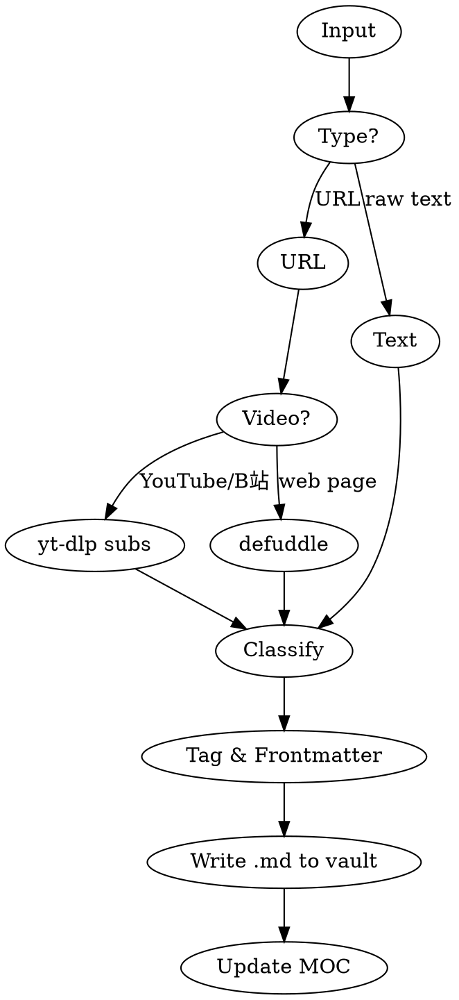

# Import to Obsidian

Save any web content, video, or text into the Obsidian vault as a structured, tagged note with graph connections.

## Vault Path

```
/Users/adam/Library/Mobile Documents/iCloud~md~obsidian/Documents/Tony
```

Folders: `前哨/`, `中文教学/`, `计算机科学/`, `数学/`, `高考/`, `最新资讯/`, `剪藏/`

## Workflow



## Step 1: Extract Content

### Web Page (default)
```bash
defuddle parse <url> --md -o /tmp/obsidian-import.md
```

### YouTube / Bilibili
```bash
# YouTube
yt-dlp --write-auto-sub --sub-lang zh,en --skip-download --convert-subs srt <url> -o /tmp/obsidian-import

# Bilibili
yt-dlp --write-sub --sub-lang zh-Hans --skip-download --convert-subs srt <url> -o /tmp/obsidian-import
```

### Raw Text
Use input directly, no extraction needed.

## Step 2: Auto-Classify

| Keywords in content | Folder |
|---|---|
| AI, 大模型, agent, LLM, GPT, Claude, DeepSeek | `最新资讯` |
| 数学, 微积分, 线性代数, 几何, 概率 | `数学` |
| 高考, 考试, 试题, 分数 | `高考` |
| 编程, 代码, 开发, software, CLI, API | `计算机科学` |
| 中文, 教学法, 语言学习, grammar | `中文教学` |
| 投资, 股市, 经济, 地缘, 出海 | `前哨` |
| No match or unclear | `剪藏` |

## Step 3: Auto-Tag

Scan title + first 500 chars for these topics and add as frontmatter tags:

`AI`, `投资`, `教育`, `数学`, `编程`, `芯片`, `自动驾驶`, `电动车`, `全球化`, `健康`, `职业`, `创业`, `中国`, `美国`, `物理`, `化学`, `生物`, `哲学`, `历史`, `经济`

## Step 4: Write Note

File: `<vault>/<folder>/<clean-title>.md`

```markdown
---
source: <url or "manual">
kb: <folder>
date: YYYY-MM-DD
tags:
  - <auto-tag-1>
  - <auto-tag-2>
url: <original-url>
---

# <Title>

<extracted content>
```

Filename rules:
- Remove `/ \ : * ? " < > |`
- Max 90 chars
- Deduplicate with `_1`, `_2` suffix

## Step 5: Update MOC

Append to `<folder>-MOC.md`:
```markdown
- [[<filename-without-ext>|<title>]] (YYYY-MM-DD)
```

## Quick Reference

| Input | Command |
|---|---|
| `/import-to-obsidian <url>` | Full pipeline |
| User says "save to obsidian" + URL | Auto-trigger |
| User says "收藏这个" + URL | Auto-trigger |
| User says "导入obsidian" | Auto-trigger |
| Raw text + "存到obsidian" | Save as note |
